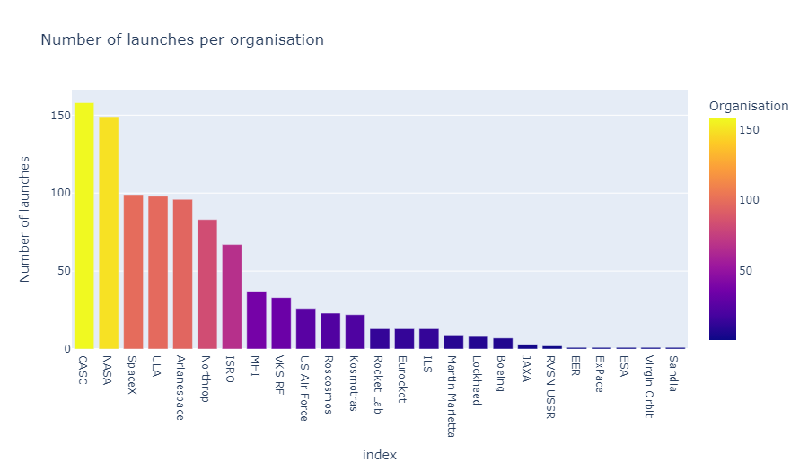

# Space-Missions-Analysis

## Introduction
This project analyzes and creates visualizations of a space missions database with the objective of showing the differences and characteristics of how companies and countries are involved in the "Space Race."

The development of this project was part of a python course I completed. The database utilized was scraped from nextflight.com. To see the complete code and other visualizations of the project, you can access the notebook in this link https://drive.google.com/file/d/14tMzDUFyKophH2bI1xGGMKRyF5ak7MGT/view?usp=sharing

## Problem Statment
1. What was the structure of the database?
2. What were the differences between organisations in terms of launches and money spent?
3. What was the distribution of the prices?
4. What where the differences between countries in terms of launches?
5. How did launches changed over the months and years present in the database?

## Skills / concepts demostrated
-Implementation of libraries such as Pandas, Plotly Express, iso3166, and Seaborn.
-Grouping data into different categories and preparing it for visualization.
-Data transformation:
  -Extracting data from within strings.
  -Conversion into different data types (e.g., from string to integer, float, etc.).
  -Generating general descriptive statistics of variables.
  -Utilizing dictionaries to map country names.
  -Employing country names to obtain corresponding ISO codes.
  -Converting time units to facilitate plotting various data over time.
  -Applying rolling mean for data smoothing.

## Visualizations and comments
1. What was the structure of the database?
  1.  the shape of the dataframe is (4324, 9)
  2.the columns names are:
     Unnamed: 0.1
     Unnamed: 0
     Organisation
     Location
     Date
     Detail
     Rocket_Status
     Price
     Mission_Status
2. What were the differences between organisations in terms of launches and money spent?
  
  CASC is the organisation with more launches. Furthermore, between the first four 
  organisations three are from the USA.
  
  Even if CASC is the organisation with more launches, we can see that NASA spent more money      per launch.
4. What was the distribution of the prices?
  
  
  The average price per project was 153.79 million USD. As shown in the boxplot and in 
  the distribution, among the outliers, the highest price represents two misions of RVSN USSR 
  (Russia).
6. What where the differences between countries in terms of launches?
  
  
  In these two maps choropleth maps, there is a clear advantage for the USA over the rest of 
  the countries. Additionally, the USA and Russia have better ratio between Launches 
  and failures than China, who shows a higher number of failures per launch.
  
  Ratio between success and failure for each country and organisation.

8. How did lauches changed over the months and years present in the database in terms of quantity and successes?
   
   
   The amount of launches per year has a growing tendence.
   
   
   
   
   The USA has consistently led the number of launches per year. Interestingly, China's number 
   of launches has been steadily incresing over the years.

   
   
   As shown in the graphic, the number of failures over time has steadily increased. This could 
   be attributed to the increased number of launches. However, when put into perspective, the 
   percentage of failures relative to the number of launches has decreased over time. This 
   trend indicates that launches have become more secure.
   
   
